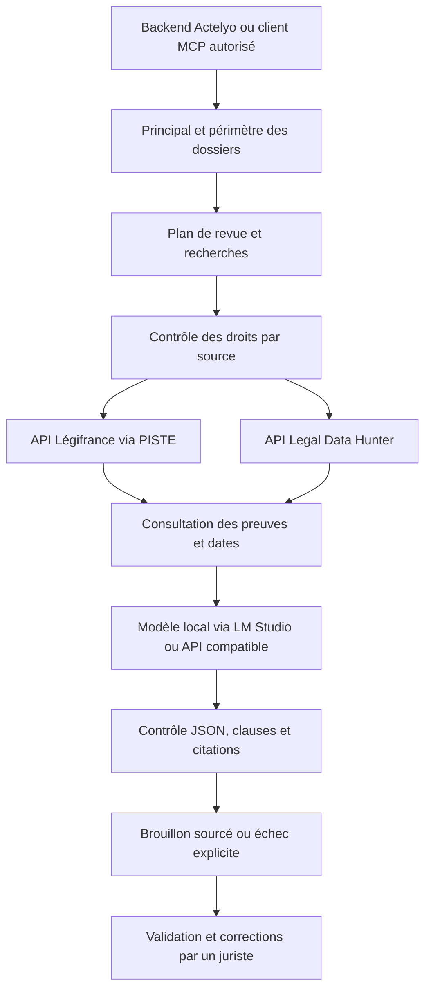

# Actelyo Law Harness — socle exécutable 0.1

Module autonome en Python 3.11+, sans dépendances d'exécution supplémentaires.
Il orchestre une revue contractuelle française, appelle des fournisseurs documentés,
et renvoie des preuves, des limites et des contrôles de citations. Il expose une API
HTTP locale et quatre outils MCP stdio. L'intégration ERP utilise une passerelle Electron locale.



## Ce qui est implémenté

- Une tâche : `contract_review`, juridiction `FR`, date du droit obligatoire.
- Plan JSON, recherches bornées, consultation des preuves complètes, rédaction JSON.
- Légifrance : OAuth2 Client Credentials, séparation sandbox/production, recherche
  dans `CODE_DATE` et consultation d'articles `LEGIARTI`.
- Legal Data Hunter : recherche jurisprudence/législation, origines autorisées
  explicitement, consultation du document identifié. Les résultats d'autres origines
  sont écartés. Aucune recherche n'est annoncée comme exhaustive.
- Modèle compatible `/v1/models` et `/v1/chat/completions`, dont LM Studio.
- Contrôle des droits de traitement, affichage et conservation ; provenance SHA-256.
- Exclusion des sources hors période ; signalement des dates inconnues.
- Contrôle des citations par identité et présence exacte du passage dans la preuve ;
  contrôle analogue pour les clauses contractuelles.
- Aucun outil d'envoi, signature, modification de dossier ou accès aux cookies éditeurs.
- API HTTP avec token, écoute sur `127.0.0.1`, requêtes sérialisées et limites de taille.
- MCP stdio : `law_status`, `law_search`, `law_fetch`, `law_review_contract`.

Les sorties sont toujours des brouillons nécessitant une validation humaine. Le
contrôle textuel ne vérifie pas la pertinence juridique, les faits, la portée d'une
décision ou l'exhaustivité de la recherche. La résistance du modèle aux instructions
malveillantes dans les documents devra aussi être évaluée sur le modèle retenu.

## Configuration et lancement

Copier `config.example.toml` vers `config.toml`, puis configurer le modèle local et les droits des sources. Aucun secret ou configuration du poste de développement n'est livré.

```powershell
Copy-Item config.example.toml config.toml
python -m law_harness --config config.toml doctor --probe-model
python -m unittest discover -s tests -v
# Génère une clé et un fichier de connexion privé pour Actelyo ERP Electron :
python -m law_harness --config config.toml serve --port 8765 --connection-file connection.json
```

Dans Actelyo ERP Electron : Paramètres → Actelyo Law Harness → connecter le fichier `connection.json`. Le fichier contient une clé : ne pas le publier ou le transmettre au navigateur. La passerelle Electron garde cette clé dans le processus principal et applique le périmètre du serveur. Voir `ACTELYO_LAW_HARNESS_INTEGRATION.md` dans ACTELYO-ERP. Le service inclus dans l'installateur se trouve sous `resources/law-harness`; utiliser Python 3.11+ ou le Python embarqué sous `resources/agent-payload`.

Pour rendre une revue possible, renseigner dans `config.toml` :

1. `principal` et `allowed_matters` : un utilisateur/cabinet et ses dossiers.
2. `allow_documents_to_model = true`, avec la base de droits documentée dans
   `documents_rights_basis` pour les documents fournis.
3. `model.name` : identifiant effectivement exposé par le serveur du modèle.
4. `allow_search_queries_external = true` : les recherches sortent du poste.
5. Pour chaque fournisseur autorisé : `enabled`, `rights_basis`, `allow_process`
   et `allow_display`. `allow_persist` reste distinct et doit être autorisé pour
   écrire un rapport contenant des preuves sur disque.
   `allow_persist_documents` doit aussi autoriser la conservation des extraits du
   contrat et du livrable.
6. Identifiants API dans les variables d'environnement du processus :
   `PISTE_CLIENT_ID`, `PISTE_CLIENT_SECRET`, `LEGAL_DATA_HUNTER_API_KEY`, et
   éventuellement `LM_STUDIO_API_TOKEN`. Ne pas les mettre dans Git ou le frontend.

Le plan demande des recherches génériques sans identité client. Ce filtrage repose
sur le modèle et n'est pas une anonymisation garantie : utiliser des documents
expurgés ou ajouter un mécanisme d'anonymisation validé avant un usage confidentiel.
Les documents du modèle restent locaux par défaut ; une URL distante nécessite
`model.allow_remote_documents = true`. Les services documentaires reçoivent les
requêtes de recherche, même quand le modèle tourne localement.

```powershell
python -m law_harness --config config.toml review examples/review-request.json
# Si et seulement si la conservation de toutes les sources est autorisée :
python -m law_harness --config config.toml review examples/review-request.json --output revue.json
```

Le rapport est affiché ou créé explicitement ; aucun cache documentaire n'est écrit.
`--output` refuse d'écraser un fichier existant. Toute capture des réponses par le
backend/client MCP doit appliquer les mêmes droits de conservation et de rétention.
Les drapeaux `allow_index` et `allow_train` réservent les droits correspondants ;
aucun indexeur ni entraînement n'est implémenté ou déclenché.

## Raccordement au backend Actelyo

Un processus/configuration/token correspond à un seul principal. Le backend Actelyo
doit authentifier l'utilisateur et sélectionner son instance autorisée. Ne pas partager
ce token avec le navigateur ou accepter un principal déclaré par le client. Cette
version n'est pas un serveur multi-utilisateur exposable directement sur Internet.

Définir `ACTELYO_HARNESS_TOKEN` côté serveur, avec au moins 32 caractères aléatoires,
puis lancer :

```powershell
python -m law_harness --config config.toml serve --port 8765
```

| Route | Méthode | Corps |
|---|---|---|
| `/health` | GET | Aucun ; diagnostic de configuration |
| `/v1/reviews` | POST | Contenu de `examples/review-request.json` |
| `/v1/search` | POST | `source`, `query`, `as_of`, `limit` optionnel |
| `/v1/fetch` | POST | `source`, `source_id`, `as_of` |

Toutes les routes exigent `Authorization: Bearer <ACTELYO_HARNESS_TOKEN>` ; les POST
exigent `Content-Type: application/json`. Aucune ouverture automatique de firewall.

```powershell
$reviewBody = Get-Content -Raw -Encoding UTF8 '.\examples\review-request.json'
$reviewHeaders = @{ Authorization = "Bearer $env:ACTELYO_HARNESS_TOKEN" }
Invoke-RestMethod -Method Post -Uri 'http://127.0.0.1:8765/v1/reviews' `
    -Headers $reviewHeaders -ContentType 'application/json; charset=utf-8' -Body $reviewBody
```

Les documents arrivent comme texte, avec des identifiants. Extraction PDF/DOCX,
OCR, authentification Actelyo, droits réels des dossiers et interface utilisateur
restent des responsabilités d'intégration dans le backend existant.

## Raccordement MCP

Configurer le client MCP avec `python`, arguments `CHEMIN_ABSOLU/run_harness.py --config CHEMIN_ABSOLU/config.toml mcp`. Les secrets sont hérités de l'environnement du processus MCP.

Le transport implémenté est stdio JSON-RPC ; il n'expose pas de serveur MCP HTTP.
Les tests couvrent initialisation, outils, erreurs et échange avec un sous-processus.
La connexion effective depuis LM Studio reste à vérifier sur l'application installée.

## Statuts et interprétation

| Statut de revue | Signification |
|---|---|
| `insufficient_evidence` | Aucune preuve exploitable ; aucune analyse inventée |
| `blocked_validation` | Sortie/citations invalides, contradiction signalée ou audit factuel non concluant ; ne pas accepter le livrable |

La génération contraint `document_id` et `evidence_id` aux identifiants réellement
fournis. Les extraits sont eux aussi limités à des passages littéraux liés à leur
document/source, puis vérifiés exactement après génération ; aucun identifiant
inconnu n'est réparé automatiquement. Une seconde lecture par le même modèle compare
les affirmations factuelles du brouillon aux contrats. Un conflit, une incertitude ou
un échec de cet audit bloque la sortie. Les constats doivent citer une affirmation
du brouillon et un passage exact du document. Ce contrôle peut manquer une contradiction
ou en signaler une à tort ; il ne certifie ni l'interprétation juridique ni l'absence
d'hallucination. `human_validation_required` reste toujours vrai. L'API conserve le
brouillon brut des rapports bloqués : chaque consommateur doit respecter leur statut.

Les passages citables sont les lignes et fenêtres de 800 caractères maximum,
découpées aux espaces si possible, du texte fourni. La source complète et le contrat
complet restent dans le contexte : ces fenêtres ne constituent pas une nouvelle
recherche ni une validation de pertinence juridique. Au-delà de 256 passages par
texte, le service exige un découpage explicite. Un fournisseur qui ignore le schéma
reste soumis aux contrôles exacts après génération.

Le texte affirmatif du brouillon (synthèse, problèmes, analyses, propositions) est
aussi contrôlé pour les numéros d'articles et numéros de pourvoi/RG identifiables.
Une référence absente des titres et textes des preuves fournies bloque la sortie.
Ce détecteur n'est pas exhaustif : il ne vérifie pas toutes les références sans
numéro, les affirmations implicites, les questions ouvertes ni les limites. La
présence d'un numéro dans une preuve ne certifie pas le raisonnement ni la décision.

La santé du service annonce `recommended_review_timeout_seconds` : budget conseillé
du client pour trois appels au modèle et une marge documentaire, borné entre 5 et
30 minutes. Le pont ERP utilise ce budget pour la revue et conserve 5 secondes pour
les appels de santé. C'est un délai client conseillé, pas une garantie de durée du
service. Le modèle d'exemple dispose de 180 secondes par appel d'inférence.
| `draft_incomplete` | Brouillon avec source en échec ou date inconnue |
| `draft` | Contrôles techniques passés ; validation juridique humaine requise |

CLI : code 0 pour un brouillon, 2 pour insuffisance de preuves ou blocage, 1 pour
erreur de configuration/exécution. API : 200 contient le statut de la revue ; ce
code HTTP ne signifie jamais une validation juridique. 401 = token incorrect,
400 = requête/usage refusé, 429 = opération en cours, 500 = erreur interne.

## Apprentissage et extensions

`PROCEDURES.md` décrit la procédure actuelle et la boucle de correction.
`examples/correction.template.json` est un modèle d'annotation humaine, sans collecte
automatique. Aucun modèle n'a été entraîné et aucun abonnement utilisateur n'a été
utilisé. « Actelyo LLMQUSHU » devra être identifié avant connexion ; il peut utiliser
le client actuel s'il expose une API compatible et un format JSON correct.

Lexis et Dalloz ont une politique réservée, mais aucun connecteur. Les activer ne
crée pas d'intégration : un appel est refusé faute d'interface officielle implémentée.
L'abonnement seul ne prouve pas le droit d'injecter les contenus dans une IA tierce.

## Références vérifiées pour la conception

- [Légifrance : OAuth, recherche et consultation](https://www.legifrance.gouv.fr/contenu/pied-de-page/foire-aux-questions-api)
- [Legal Data Hunter : API de recherche et consultation](https://legaldatahunter.com/docs/quickstart)
- [Legal Data Hunter : conditions API/MCP, intégration et réutilisation](https://legaldatahunter.com/api-mcp-terms)
- [LM Studio : Chat Completions](https://lmstudio.ai/docs/developer/openai-compat/chat-completions)
- [Lexis+ / Lexis+ AI : conditions d'utilisation](https://www.lexisnexis.com/fr-fr/cgu/lexis-plus)
- [Lefebvre Dalloz : conditions d'utilisation](https://www.lefebvre-dalloz.fr/conditions-generales-dutilisation/)

Les tests fournisseurs utilisent des réponses synthétiques : ils vérifient les
contrats de requêtes et les contrôles, pas l'accès réel ni une couverture complète des
schémas. Vérifier avec les identifiants du cabinet les réponses et dates effectivement
retournées avant mise en production. Le diagnostic `doctor` ne teste aucune recherche
payante et distingue configuration de disponibilité du serveur de modèles.
